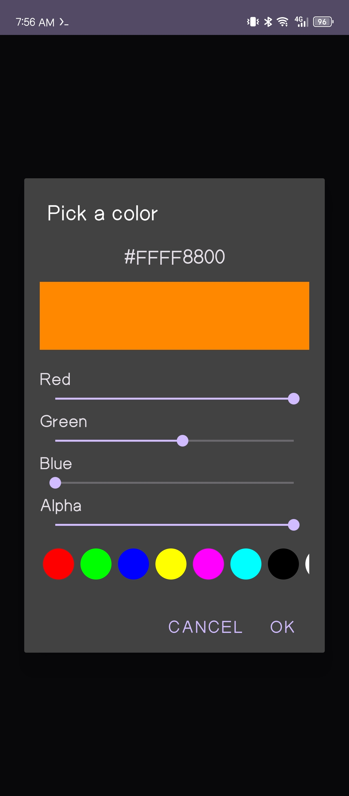

## What is Ccawlor?
Ccawlor is a simple, reusable custom color picker displayed in a dialog.  
It can be used in any class or activity.

It uses the `Color.rgb(int r, int g, int b)` function to generate a color based on the values of the SeekBars.

## Demo

